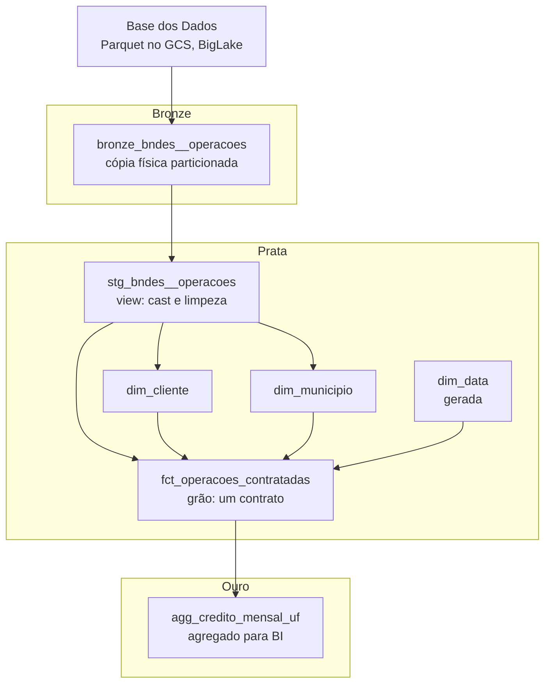

# dbt-data-process

Pipeline de engenharia de dados sobre as operações de crédito não automáticas do BNDES, implementando arquitetura medallion (bronze, prata, ouro) com modelagem dimensional em star schema.

**Stack:** dbt Core 1.9 · BigQuery · GitHub Actions · Base dos Dados

---

## Sumário

- [Arquitetura](#arquitetura)
- [Pré-requisitos](#pré-requisitos)
- [Setup inicial](#setup-inicial)
- [Camada bronze](#camada-bronze)
- [Camada prata](#camada-prata)
- [Camada ouro](#camada-ouro)
- [Testes](#testes)
- [Execução](#execução)
- [Automação](#automação)
- [Documentação](#documentação)
- [Consumo](#consumo)
- [Problemas conhecidos](#problemas-conhecidos)

---

## Arquitetura



### Por que medallion

| Camada | Conformidade | Materialização | Propósito |
|---|---|---|---|
| Bronze | source-conformed | `table` | Isolar o pipeline de mudanças upstream |
| Prata | business-conformed | `view` + `table` | Modelagem dimensional, testes |
| Ouro | consumo | `table` | Agregados prontos para dashboard |

A bronze é sempre materialização física. A fonte da Base dos Dados é uma tabela externa BigLake apontando para Parquet no GCS — uma view sobre ela falharia, porque exigiria permissão sobre a *connection* do projeto `basedosdados`, que não é concedível. O `CREATE TABLE AS SELECT` lê uma vez, sob a nossa sessão, e congela o snapshot.

### Por que star schema

O grão do fato é **um contrato**. Três dimensões conformadas respondem quem, onde e quando:

```
                  dim_data
                     |
   dim_cliente — fct_operacoes_contratadas — dim_municipio
```

Toda dimensão está a exatamente um join do fato, e nenhuma se liga a outra. Não normalizamos município em UF e região (o que faria um snowflake) porque em BigQuery, com storage colunar e compressão, dimensões achatadas custam praticamente nada e economizam joins.

`id_contrato` e `descricao_projeto` são **dimensões degeneradas**: ficam no fato, sem tabela própria, porque são quase 1:1 com a linha.

---

## Pré-requisitos

- Projeto GCP com **billing habilitado** (o sandbox bloqueia DML, ver [Problemas conhecidos](#problemas-conhecidos))
- Dataset de destino na região `US` — a mesma da Base dos Dados; não existe query cross-region
- Service account com as roles:
  - `roles/bigquery.jobUser`
  - `roles/bigquery.dataEditor`
- Python 3.11

---

## Setup inicial

### Local

```bash
python -m venv .venv
source .venv/bin/activate
pip install dbt-core==1.9.* dbt-bigquery==1.9.*
dbt deps
dbt debug
```

`~/.dbt/profiles.yml`:

```yaml
bndes:
  target: dev
  outputs:
    dev:
      type: bigquery
      method: service-account
      keyfile: /caminho/para/key.json
      project: 
      dataset: dbt_seu_nome
      location: US
      threads: 4
```

O `location: US` não é opcional. Sem ele o dbt assume a região default e a leitura da Base dos Dados falha com `Dataset was not found in location`.

### Estrutura do projeto

```
dbt-data-process/
├── .github/workflows/
│   ├── dbt.yml                    # build agendado
│   └── dbt_docs.yml               # documentação sob demanda
├── models/
│   ├── bronze/
│   │   ├── _bd__sources.yml
│   │   └── bronze_bndes__operacoes.sql
│   ├── staging/bndes/
│   │   ├── _bndes__models.yml
│   │   └── stg_bndes__operacoes.sql
│   └── marts/credito/
│       ├── _credito__models.yml
│       ├── dim_cliente.sql
│       ├── dim_data.sql
│       ├── dim_municipio.sql
│       ├── fct_operacoes_contratadas.sql
│       └── agg_credito_mensal_uf.sql
├── tests/
│   └── assert_fato_sem_duplicata.sql
├── dbt_project.yml
├── packages.yml
└── .gitignore
```

### `dbt_project.yml`

```yaml
name: 'bndes'
version: '1.0.0'
profile: 'bndes'

model-paths: ["models"]
test-paths: ["tests"]

models:
  bndes:
    bronze:
      +materialized: table
      +schema: bronze
    staging:
      +materialized: view
    marts:
      +materialized: table
      +schema: silver
```

Atenção: `+schema: silver` **não** cria um dataset chamado `silver`. O dbt concatena com o dataset do profile, gerando `prod_silver` ou `dbt_seu_nome_silver`. É o comportamento padrão e é desejável — isola dev de produção.

### `packages.yml`

```yaml
packages:
  - package: dbt-labs/dbt_utils
    version: [">=1.1.0", "<2.0.0"]
```

### `.gitignore`

```
target/
dbt_packages/
logs/
.venv/
*.json
.env
.streamlit/secrets.toml
```

O `*.json` impede que a chave da service account vaze para o repositório.

---

## Camada bronze

Cópia física da fonte, sem nenhuma transformação de negócio.

### Passo 1 — Declarar a fonte

`models/bronze/_bd__sources.yml`:

```yaml
version: 2

sources:
  - name: bd_bndes
    database: basedosdados
    schema: br_bndes_operacoes_contratadas
    description: "Operações de crédito do BNDES via Base dos Dados"
    tables:
      - name: operacoes_nao_automaticas
        config:
          loaded_at_field: data_contratacao
          freshness:
            warn_after: {count: 90, period: day}
```

O bloco `freshness` habilita `dbt source freshness`, que avisa quando a origem parou de ser atualizada.

### Passo 2 — Materializar

`models/bronze/bronze_bndes__operacoes.sql`:

```sql
{{ config(
    materialized = 'table',
    partition_by = {'field': 'data_contratacao', 'data_type': 'date', 'granularity': 'month'},
    cluster_by = ['sigla_uf', 'id_municipio']
) }}

select
    id_contrato,
    cnpj_cliente,
    razao_social_cliente,
    data_contratacao,
    descricao_projeto,
    id_municipio,
    nome_municipio,
    sigla_uf,
    valor_contratado,
    valor_desembolsado
from {{ source('bd_bndes', 'operacoes_nao_automaticas') }}
```

Particionamento mensal por `data_contratacao` e clustering por UF e município: toda consulta filtrada por período ou região lê só as partições relevantes.

### Passo 3 — Diagnosticar o grão

Antes de modelar qualquer coisa, rode:

```sql
select
  count(*)                       as linhas,
  count(distinct id_contrato)    as contratos,
  countif(id_municipio is null)  as mun_nulo,
  countif(cnpj_cliente is null)  as cnpj_nulo,
  min(data_contratacao)          as dt_min,
  max(data_contratacao)          as dt_max
from `safraviva-f1.prod_bronze.bronze_bndes__operacoes`;
```

Se `linhas > contratos`, o grão não é o contrato — é contrato × município ou contrato × data — e o fato precisa de chave composta.

Se `mun_nulo > 0` ou `cnpj_nulo > 0`, as dimensões precisam de membro "Não informado".

E confirme a dependência funcional antes de extrair `dim_municipio`:

```sql
-- retorna 0 se id_municipio determina nome e UF
select count(*) from (
  select id_municipio
  from `safraviva-f1.prod_bronze.bronze_bndes__operacoes`
  group by id_municipio
  having count(distinct nome_municipio) > 1
      or count(distinct sigla_uf) > 1
);
```

---

## Camada prata

### Passo 4 — Staging

`models/staging/bndes/stg_bndes__operacoes.sql`:

```sql
with fonte as (
    select * from {{ ref('bronze_bndes__operacoes') }}
),

limpo as (
    select
        cast(id_contrato as string)          as id_contrato,
        cast(cnpj_cliente as string)         as cnpj_cliente,
        trim(razao_social_cliente)           as razao_social_cliente,
        cast(data_contratacao as date)       as data_contratacao,
        cast(id_municipio as string)         as id_municipio,
        trim(nome_municipio)                 as nome_municipio,
        upper(trim(sigla_uf))                as sigla_uf,
        trim(descricao_projeto)              as descricao_projeto,
        cast(valor_contratado as numeric)    as valor_contratado,
        cast(valor_desembolsado as numeric)  as valor_desembolsado
    from fonte
    where data_contratacao is not null
)

select * from limpo
```

Regra da camada: **renomeia, casteia, limpa — nunca junta**. Um model de staging por tabela de origem. Materializado como view, porque a lógica é barata e não vale storage.

### Passo 5 — Dimensão de data

`models/marts/credito/dim_data.sql`:

```sql
with dias as (
    select dia
    from unnest(generate_date_array('1995-01-01', '2035-12-31')) as dia
)

select
    dia                                    as sk_data,
    extract(year    from dia)              as ano,
    extract(month   from dia)              as mes,
    extract(quarter from dia)              as trimestre,
    format_date('%Y-%m', dia)              as ano_mes,
    format_date('%B', dia)                 as nome_mes,
    extract(dayofweek from dia) in (1, 7)  as eh_fim_de_semana
from dias
```

Dimensão de data é **gerada, nunca derivada do fato**. Derivando, meses sem contrato sumiriam da série — buraco silencioso que estraga qualquer análise temporal ou forecast.

### Passo 6 — Dimensão de município

`models/marts/credito/dim_municipio.sql`:

```sql
with base as (
    select distinct
        id_municipio,
        nome_municipio,
        sigla_uf
    from {{ ref('stg_bndes__operacoes') }}
    where id_municipio is not null
),

municipios as (
    select
        id_municipio    as sk_municipio,
        nome_municipio,
        sigla_uf,
        case
            when sigla_uf in ('AC','AP','AM','PA','RO','RR','TO') then 'Norte'
            when sigla_uf in ('AL','BA','CE','MA','PB','PE','PI','RN','SE') then 'Nordeste'
            when sigla_uf in ('DF','GO','MT','MS') then 'Centro-Oeste'
            when sigla_uf in ('ES','MG','RJ','SP') then 'Sudeste'
            when sigla_uf in ('PR','RS','SC') then 'Sul'
        end             as regiao
    from base
),

nao_informado as (
    select
        '-1'             as sk_municipio,
        'Não informado'  as nome_municipio,
        'XX'             as sigla_uf,
        'Não informado'  as regiao
)

select * from municipios
union all
select * from nao_informado
```

O membro `-1` é padrão Kimball: garante que linhas do fato sem município ainda apareçam num `inner join`. Sem ele, valores desaparecem dos totais sem aviso.

Os blocos estão em CTEs nomeados de propósito. Union posicional solto é fonte clássica de bug: basta alguém inserir uma coluna no meio do select principal para os valores desalinharem sem erro.

### Passo 7 — Dimensão de cliente

`models/marts/credito/dim_cliente.sql`:

```sql
with base as (
    select
        cnpj_cliente,
        max(razao_social_cliente) as razao_social_cliente,
        min(data_contratacao)     as primeira_operacao,
        max(data_contratacao)     as ultima_operacao,
        count(*)                  as qtd_operacoes,
        sum(valor_contratado)     as total_contratado
    from {{ ref('stg_bndes__operacoes') }}
    where cnpj_cliente is not null
    group by cnpj_cliente
),

clientes as (
    select
        cnpj_cliente                as sk_cliente,
        cnpj_cliente,
        substr(cnpj_cliente, 1, 8)  as raiz_cnpj,
        razao_social_cliente,
        primeira_operacao,
        ultima_operacao,
        qtd_operacoes,
        total_contratado
    from base
),

nao_informado as (
    select
        '-1'                  as sk_cliente,
        cast(null as string)  as cnpj_cliente,
        cast(null as string)  as raiz_cnpj,
        'Não informado'       as razao_social_cliente,
        cast(null as date)    as primeira_operacao,
        cast(null as date)    as ultima_operacao,
        0                     as qtd_operacoes,
        cast(0 as numeric)    as total_contratado
)

select * from clientes
union all
select * from nao_informado
```

Cada `NULL` tem cast explícito. Sem isso o BigQuery infere `INT64` e o `union all` falha por incompatibilidade de tipo.

**Decisão registrada:** esta é uma **SCD tipo 1**. O `max(razao_social_cliente)` mantém apenas a última razão social conhecida. Se um CNPJ mudou de nome entre 2010 e 2024, a história se perde. Adequado para o escopo atual; se o histórico passar a importar, o caminho é `dbt snapshot` com `valido_de`/`valido_ate`.

### Passo 8 — Tabela fato

`models/marts/credito/fct_operacoes_contratadas.sql`:

```sql
{{ config(
    materialized = 'incremental',
    incremental_strategy = 'insert_overwrite',
    partition_by = {'field': 'sk_data', 'data_type': 'date', 'granularity': 'month'},
    cluster_by = ['sk_municipio', 'sk_cliente'],
    on_schema_change = 'append_new_columns'
) }}

select
    -- chaves estrangeiras
    data_contratacao                as sk_data,
    coalesce(cnpj_cliente, '-1')    as sk_cliente,
    coalesce(id_municipio, '-1')    as sk_municipio,

    -- dimensões degeneradas
    id_contrato,
    descricao_projeto,

    -- medidas
    valor_contratado,
    valor_desembolsado,
    valor_contratado - valor_desembolsado              as valor_a_desembolsar,
    safe_divide(valor_desembolsado, valor_contratado)  as taxa_desembolso

from {{ ref('stg_bndes__operacoes') }}


where data_contratacao >= (
    select date_sub(max(sk_data), interval 3 month) from {{ this }}
)

```

Três decisões:

O `coalesce(..., '-1')` conecta ao membro "Não informado" das dimensões, fechando a integridade referencial.

O `insert_overwrite` com partição mensal **substitui partições inteiras** em vez de fazer merge linha a linha. Mais barato e sem risco de duplicata.

A janela de 3 meses existe porque dados públicos são retificados retroativamente. Reprocessar só o último mês deixaria correções para trás.

---

## Camada ouro

### Passo 9 — Agregado para consumo

`models/marts/credito/agg_credito_mensal_uf.sql`:

```sql
{{ config(materialized='table') }}

select
    t.ano,
    t.ano_mes,
    m.sigla_uf,
    m.regiao,
    count(*)                    as qtd_operacoes,
    sum(f.valor_contratado)     as total_contratado,
    sum(f.valor_desembolsado)   as total_desembolsado,
    safe_divide(sum(f.valor_desembolsado), sum(f.valor_contratado)) as taxa_desembolso
from {{ ref('fct_operacoes_contratadas') }} f
join {{ ref('dim_data') }}      t on f.sk_data      = t.sk_data
join {{ ref('dim_municipio') }} m on f.sk_municipio = m.sk_municipio
group by 1, 2, 3, 4
```

Alguns milhares de linhas em vez de milhões. É o motivo de existir a camada ouro: o dashboard lê o resultado pronto em vez de agregar a cada carga.

---

## Testes

`models/marts/credito/_credito__models.yml`:

```yaml
version: 2

models:
  - name: dim_cliente
    columns:
      - name: sk_cliente
        data_tests: [unique, not_null]

  - name: dim_municipio
    columns:
      - name: sk_municipio
        data_tests: [unique, not_null]
      - name: sigla_uf
        data_tests:
          - accepted_values:
              arguments:
                values: ['AC','AL','AP','AM','BA','CE','DF','ES','GO','MA','MT',
                         'MS','MG','PA','PB','PR','PE','PI','RJ','RN','RS','RO',
                         'RR','SC','SP','SE','TO','XX']

  - name: dim_data
    columns:
      - name: sk_data
        data_tests: [unique, not_null]

  - name: fct_operacoes_contratadas
    data_tests:
      - dbt_utils.expression_is_true:
          arguments:
            expression: "valor_desembolsado <= valor_contratado * 1.01"
    columns:
      - name: id_contrato
        data_tests: [not_null]
      - name: sk_cliente
        data_tests:
          - not_null
          - relationships:
              arguments:
                to: ref('dim_cliente')
                field: sk_cliente
      - name: sk_municipio
        data_tests:
          - relationships:
              arguments:
                to: ref('dim_municipio')
                field: sk_municipio
      - name: sk_data
        data_tests:
          - relationships:
              arguments:
                to: ref('dim_data')
                field: sk_data
      - name: valor_contratado
        data_tests:
          - dbt_utils.accepted_range:
              arguments:
                min_value: 0
```

O formato `arguments:` é exigido a partir de versões recentes. Testes sem parâmetro (`unique`, `not_null`) continuam na forma simples.

Os três testes `relationships` são o coração do star schema: provam que todo join fato↔dimensão funciona sem chave órfã. O BigQuery não impõe integridade referencial — PK e FK ali são apenas metadados, não validados.

Teste singular em `tests/assert_fato_sem_duplicata.sql`:

```sql
select id_contrato, count(*) as n
from {{ ref('fct_operacoes_contratadas') }}
group by 1
having count(*) > 1
```

Retorna linhas quando há problema. Se o diagnóstico do Passo 3 mostrou `linhas > contratos`, este teste falha de propósito — e a chave precisa virar composta.

---

## Execução

| Comando | O que faz |
|---|---|
| `dbt deps` | instala pacotes do `packages.yml` |
| `dbt debug` | valida conexão e credenciais |
| `dbt ls` | lista os models que o dbt enxerga |
| `dbt build` | roda models e testes em ordem de dependência |
| `dbt build --select marts.credito+` | só os marts e o que depende deles |
| `dbt build --full-refresh` | reconstrói incrementais do zero |
| `dbt source freshness` | verifica se a origem envelheceu |
| `dbt docs generate` | gera catálogo e site de documentação |

Use `dbt build`, não `dbt run`. Ele para antes de construir o que depende de algo que falhou nos testes, em vez de propagar dado ruim adiante.

Se `dbt ls` não listar um model que você criou, o dbt não está enxergando o arquivo — nenhum `run` vai adiantar.

---

## Automação

### `.github/workflows/dbt.yml`

```yaml
name: dbt build

on:
  schedule:
    - cron: '0 9 * * 1'
  workflow_dispatch:

jobs:
  build:
    runs-on: ubuntu-latest
    steps:
      - uses: actions/checkout@v4

      - uses: google-github-actions/auth@v2
        with:
          credentials_json: ${{ secrets.GCP_SA_KEY }}

      - uses: actions/setup-python@v5
        with:
          python-version: '3.11'

      - run: pip install dbt-core==1.9.* dbt-bigquery==1.9.*

      - name: Criar profiles.yml
        run: |
          mkdir -p ~/.dbt
          cat > ~/.dbt/profiles.yml <<'EOF'
          bndes:
            target: prod
            outputs:
              prod:
                type: bigquery
                method: oauth
                project: safraviva-f1
                dataset: prod
                location: US
                threads: 4
          EOF

      - run: dbt deps

      - run: dbt build --target prod

      - name: Salvar artefatos
        if: always()
        uses: actions/upload-artifact@v4
        with:
          name: dbt-artifacts
          path: target/
          retention-days: 7
```

A action `google-github-actions/auth` recebe o JSON cru e exporta `GOOGLE_APPLICATION_CREDENTIALS` sozinha. O profile usa `method: oauth`, que lê essa variável. Zero manipulação de string — a chave privada contém `\n` que o `echo` corrompe.

**Secret necessário:** `GCP_SA_KEY` com o conteúdo completo do JSON da service account, do `{` ao `}`.

---

## Documentação

```bash
dbt docs generate --target prod
```

Pelo GitHub Actions, baixe o artefato `dbt-artifacts` na aba Actions e descompacte.

**Não abra o `index.html` com duplo clique.** O dbt busca `manifest.json` e `catalog.json` via `fetch()`, e o navegador bloqueia isso no protocolo `file://` por CORS — a página fica em branco. Suba um servidor local:

```bash
cd dbt-artifacts
python -m http.server 8080
```

E acesse `http://localhost:8080`. O botão **Lineage Graph** fica no canto inferior direito.

Conteúdo do artefato:

| Arquivo | Para quê |
|---|---|
| `manifest.json` | models, dependências, SQL compilado |
| `catalog.json` | colunas, tipos e tamanhos vindos do BigQuery |
| `run_results.json` | tempo e status de cada nó |
| `compiled/`, `run/` | SQL final enviado ao banco |

---

## Consumo

### Power BI

Obter dados → Google BigQuery → projeto `safraviva-f1` → dataset `prod_silver`.

Relacionamentos (um-para-muitos, direção única):

- `dim_cliente[sk_cliente]` → `fct_operacoes_contratadas[sk_cliente]`
- `dim_municipio[sk_municipio]` → `fct_operacoes_contratadas[sk_municipio]`
- `dim_data[sk_data]` → `fct_operacoes_contratadas[sk_data]`

Marque `dim_data` como tabela de datas (Modelagem → Marcar como tabela de datas), senão as funções de inteligência temporal não funcionam.

Prefira **Import** a DirectQuery: os dados ficam no arquivo e cada filtro não vira uma query cobrada.

### Streamlit

```python
import streamlit as st
from google.cloud import bigquery
from google.oauth2 import service_account

creds = service_account.Credentials.from_service_account_info(
    st.secrets["gcp_service_account"]
)
client = bigquery.Client(credentials=creds, project="safraviva-f1")

@st.cache_data(ttl=3600)
def carregar():
    sql = "select * from `safraviva-f1.prod_silver.agg_credito_mensal_uf`"
    return client.query(sql).to_dataframe()

df = carregar()
```

O `@st.cache_data(ttl=3600)` impede que cada interação dispare uma query nova.

Crie uma **service account separada** para leitura, com apenas `BigQuery Data Viewer` + `BigQuery Job User`. A do dbt tem permissão de escrita e não deveria estar num app de consulta.

---

## Problemas conhecidos

### BigQuery Sandbox bloqueia DML

Sem billing vinculado, o BigQuery permite DDL (`CREATE TABLE AS SELECT`) mas recusa DML (`INSERT`, `MERGE`). Consequência: models `table` funcionam, models `incremental` falham com:

```
Billing has not been enabled for this project.
DML queries are not allowed in the free tier.
```

**Solução A** — vincular conta de faturamento. O free tier permanente (1 TB de query e 10 GB de storage por mês) continua valendo; no volume deste projeto, custo zero. Também remove a expiração automática de 60 dias que o sandbox impõe às tabelas.

**Solução B** — trocar o fato para `materialized='table'` e remover o bloco ``. Funciona sem cartão, mas perde a demonstração de carga incremental.

### View sobre a Base dos Dados falha

As tabelas da Base dos Dados são externas/BigLake, apontando para Parquet no GCS através de uma *connection* do projeto `basedosdados`. Uma view exigiria resolver essa connection com as credenciais de quem consulta — permissão que não é concedível. Por isso a bronze é sempre `table`.

Verificação:

```sql
select table_name, table_type, ddl
from `basedosdados.br_bndes_operacoes_contratadas.INFORMATION_SCHEMA.TABLES`
where table_name = 'operacoes_nao_automaticas';
```

### Região

A Base dos Dados está em `US` (multi-region). Se o dataset de destino estiver em `southamerica-east1`, a query falha com `Dataset was not found in location`. Não existe query cross-region no BigQuery — seria necessário Data Transfer Service ou `bq cp`.

### `valor_desembolsado` pode ser semi-aditivo

Se o campo for acumulado até a data de extração e não um evento, somá-lo ao longo do tempo dupla-conta. O modelo correto seria uma segunda fato — `fct_desembolsos`, grão contrato × data de desembolso — compartilhando as mesmas três dimensões (**fact constellation**). Verificar antes de publicar séries temporais de desembolso.

### Duas versões de dbt

O dbt Studio (Fusion) e o GitHub Actions (Core 1.9) têm parsers diferentes de YAML. O Fusion é mais rígido e recusa formatos que o Core aceita. Fixe a mesma versão nos dois ambientes — desenvolver numa versão e fazer deploy em outra produz bug que só aparece em produção.

---

## Fonte dos dados

[Base dos Dados — BNDES: operações contratadas](https://basedosdados.org/dataset/2810837f-e52b-4da0-a4e9-e7ad4109ffe7)
